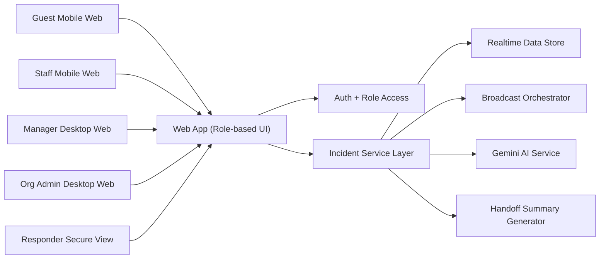
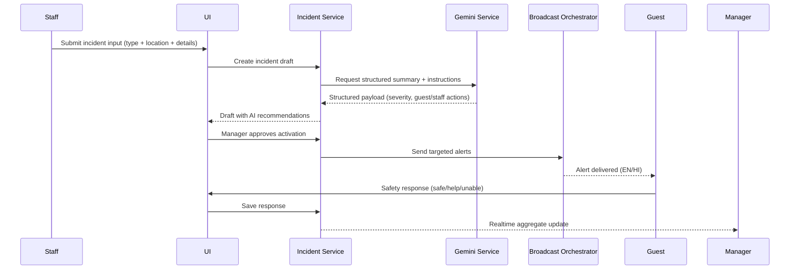

# Crisis OS - MVP Architecture

Version: `v1.0`  
Audience: Product, engineering, and AI coding agents  
Scope: 3-day MVP for rapid crisis coordination in hospitality settings

## 1) Architecture Goals

- Enable crisis coordination across `Org Admin`, `Manager`, `Staff`, `Guest`, and `Responder` roles.
- Provide a single source of truth during incidents.
- Keep architecture simple enough for 2 developers and AI agents in 3 days.
- Support mobile-first guest experiences and desktop-first operations experiences.

## 2) System Context

Primary entities:
- Organization
- Property (hotel/hostel; hospital label optional for future compatibility)
- Floors, rooms, zones
- Users by role
- Incidents
- Guest safety responses
- Broadcast messages
- Incident timeline + handoff summary

High-level architecture:

## 3) Component Breakdown

Frontend app:
- Single web app with role-based route guards and role-specific dashboards.
- Responsive strategy:
  - Guest and staff: mobile-first
  - Manager and admin: desktop-first, mobile-safe for emergency controls

Backend service layer:
- Auth and role verification
- Incident lifecycle orchestration
- Broadcast targeting and delivery workflow
- Guest response ingestion and aggregation
- Responder handoff summary generation

AI layer:
- Structured extraction from raw incident text
- Severity recommendation
- Role-based instruction generation
- Escalation recommendation generation

## 4) Incident Lifecycle Workflow

Lifecycle states:
- `draft`
- `active`
- `resolved`

State transition rules:
- Staff/manager can create `draft`.
- Manager can activate incident and trigger broadcast.
- Manager can mark as resolved after checks complete.
- Resolved incidents become read-only except audit notes.

## 5) Data Workflow (No Schema, Contract-Level)

## 6) User Flow (Operational)

### A) Organization Onboarding Flow

1. Org admin signs up and creates organization.
2. Org admin adds property.
3. Org admin configures floors, rooms, and zones.
4. Org admin uploads floor map images (MVP image-based mapping).
5. Org admin creates manager/staff accounts.
6. Org admin configures guest join options:
   - property code
   - room QR
7. Org admin runs a test drill and activates property.

### B) Crisis Response Flow

1. Staff or manager reports incident.
2. AI generates structured summary + instructions.
3. Manager reviews and broadcasts.
4. Guests receive alert and submit status.
5. Dashboard shows live response and unresolved critical cases.
6. Manager shares responder handoff view.
7. Manager marks incident resolved and publishes all-clear.

## 7) Manual Operations Workflow (Required in Roadmaps)

Front-desk / operations manual steps:
1. During check-in, guest scans room QR or enters property code.
2. Staff confirms guest joined the safety channel.
3. Manager runs daily drill check once per shift.
4. In incident mode, manager selects crisis type and location before broadcast.
5. Staff performs room/floor checklist and posts updates.
6. Manager validates unresolved guests before all-clear.

Emergency fallback manual steps:
1. If AI generation fails, manager uses pre-approved template messages.
2. If broadcast fails, staff triggers manual PA message from template.
3. If live dashboard stalls, refresh with timeline snapshot mode.

## 8) Security and Access Controls

- Role-based access checks for every protected route and API action.
- Guest access scoped to property and active incident context only.
- Responder links read-only and time-limited.
- Audit timeline stores every critical incident action.

## 9) AI-Agent Coding Architecture Guidance

This project is intended for AI-assisted implementation. Use these execution controls:

- Split work into atomic task cards (`FE-*`, `BE-*`) with acceptance criteria.
- Keep backend contracts stable after Day 1.
- Use deterministic sample data for repeatable demos.
- Use fallback templates for AI output failures.

## 10) Figma Design System Rules Integration

Add design system rule generation at project start so all AI coding agents produce consistent UI code and naming conventions.

Skill requested for this project:
- `$figma:figma-create-design-system-rules`
- Source: `C:\Users\Yashraj Rastogi\.codex\plugins\cache\openai-curated\figma\f09cfd210e21e96a0031f4d247be5f2e416d23b1\skills\figma-create-design-system-rules\SKILL.md`

Expected integration artifact:
- `AGENTS.md` in project root containing:
  - component placement rules
  - token usage rules
  - Figma-to-code implementation flow
  - asset handling rules

## 11) Non-Goals (MVP Constraints)

- No direct building speaker hardware integration
- No real IoT sensor integration
- No autonomous multi-agent orchestration at infrastructure level
- No multi-tenant enterprise analytics
- No full hospital workflow implementation in MVP

## 12) Acceptance Criteria for Architecture Completeness

- All roles can complete primary workflows.
- Incident lifecycle works end-to-end with realtime updates.
- Guest mobile experience is fully functional.
- Manager dashboard can resolve incidents and produce handoff summary.
- Manual fallback operations are documented and testable.

