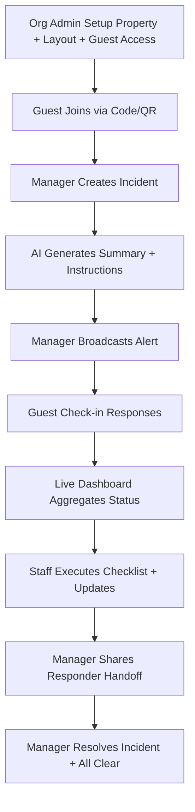

# Crisis OS - Screen-by-Screen MVP App Flow

Version: `v1.0`  
Purpose: Implementation blueprint for AI coding agents and dev team  
Scope: MVP screens only (3-day build)

## 1) Route Map (MVP)

Common:
- `/login`
- `/select-role` (optional helper in demo mode)

Org Admin:
- `/admin/setup/organization`
- `/admin/setup/property`
- `/admin/setup/layout`
- `/admin/setup/guest-access`
- `/admin/drill`

Manager:
- `/manager/dashboard`
- `/manager/incidents/new`
- `/manager/incidents/:id/review`
- `/manager/incidents/:id/broadcast`
- `/manager/incidents/:id/live`
- `/manager/incidents/:id/handoff`
- `/manager/incidents/:id/resolve`

Staff:
- `/staff/home`
- `/staff/report`
- `/staff/incidents/:id/checklist`
- `/staff/incidents/:id/update`

Guest:
- `/guest/join`
- `/guest/home`
- `/guest/incidents/:id/alert`
- `/guest/incidents/:id/check-in`

Responder:
- `/responder/incidents/:id/view`

## 2) Screen Definitions by Role

## Common Screens

### `CM-01` Login (`/login`)
Role: all  
Device: mobile + desktop  
Purpose: authenticate user and resolve role  
Primary actions:
- enter credentials/OTP
- submit auth request
Exit conditions:
- success -> role landing route
- failure -> inline error

### `CM-02` Role Helper (`/select-role`)
Role: demo/test helper  
Device: mobile + desktop  
Purpose: fast role switching for demo scenarios  
Primary actions:
- pick role persona
- continue to route

## Org Admin Screens

### `OA-01` Organization Setup (`/admin/setup/organization`)
Device: desktop-first  
Inputs:
- org name
- contact email
- emergency phone

Outputs:
- organization created

### `OA-02` Property Setup (`/admin/setup/property`)
Device: desktop-first  
Inputs:
- property name
- property type (`hotel`/`hostel`)
- address
- default language set

Outputs:
- property profile created

### `OA-03` Layout Setup (`/admin/setup/layout`)
Device: desktop-first  
Inputs:
- floor list
- room/bed blocks
- zone labels
- map image upload (MVP simple image)

Outputs:
- location hierarchy available to incident targeting

### `OA-04` Guest Access Setup (`/admin/setup/guest-access`)
Device: desktop-first  
Inputs:
- property join code policy
- room QR generation trigger

Outputs:
- join code + QR assets

### `OA-05` Drill Console (`/admin/drill`)
Device: desktop-first  
Purpose:
- run test alert and verify routing

## Manager Screens

### `MG-01` Command Dashboard (`/manager/dashboard`)
Device: desktop-first, mobile-safe  
Purpose:
- view active incidents and readiness state 

Widgets:
- active incidents list
- response KPIs
- unresolved critical cases
- quick actions

### `MG-02` Create Incident (`/manager/incidents/new`)
Device: desktop + mobile  
Inputs:
- incident type
- floor/zone
- free-text details

Action:
- create draft incident

### `MG-03` AI Review (`/manager/incidents/:id/review`)
Device: desktop + mobile  
Shows:
- AI structured summary
- severity
- guest/staff instructions
- escalation recommendation

Action:
- approve and proceed to broadcast

### `MG-04` Broadcast Center (`/manager/incidents/:id/broadcast`)
Device: desktop + mobile  
Inputs:
- target audience (`all`, `floor`, `zone`, `staff only`)
- language option

Action:
- trigger broadcast

### `MG-05` Live Response Board (`/manager/incidents/:id/live`)
Device: desktop-first  
Shows:
- safe/help/unable/pending counts
- room/zone status table
- latest updates timeline

Actions:
- escalate
- assign staff checks

### `MG-06` Responder Handoff (`/manager/incidents/:id/handoff`)
Device: desktop + mobile  
Shows:
- summary
- affected zones
- unresolved critical cases
- response timeline

Actions:
- copy/share secure responder link

### `MG-07` Resolve Incident (`/manager/incidents/:id/resolve`)
Device: desktop + mobile  
Inputs:
- closure note
- checklist confirmation
Action:
- mark resolved and publish all-clear

## Staff Screens

### `ST-01` Staff Home (`/staff/home`)
Device: mobile-first  
Shows:
- assigned incidents
- pending tasks
- quick report action

### `ST-02` Quick Report (`/staff/report`)
Device: mobile-first  
Inputs:
- incident type
- location
- text update
- optional photo (future-ready; optional for MVP)
Action:
- create/update incident signal

### `ST-03` Checklist (`/staff/incidents/:id/checklist`)
Device: mobile-first  
Shows:
- zone/room check tasks
Actions:
- mark check complete
- mark hazard/blocked route

### `ST-04` Status Update (`/staff/incidents/:id/update`)
Device: mobile-first  
Inputs:
- guest assistance outcome
- floor clear status
Action:
- push status to manager board

## Guest Screens

### `GS-01` Join Property (`/guest/join`)
Device: mobile-first  
Inputs:
- property code or room QR
- guest name + room/bed
Action:
- join property safety channel

### `GS-02` Guest Home (`/guest/home`)
Device: mobile-first  
Shows:
- current safety state
- latest instructions
- active incident card (if any)

### `GS-03` Alert Detail (`/guest/incidents/:id/alert`)
Device: mobile-first  
Shows:
- bilingual alert message
- do/don't checklist
- evacuation note

### `GS-04` Safety Check-In (`/guest/incidents/:id/check-in`)
Device: mobile-first  
Actions:
- `I am Safe`
- `Need Help`
- `Unable to Move`
- optional note field

## Responder Screen

### `RS-01` Responder View (`/responder/incidents/:id/view`)
Device: mobile + desktop  
Mode: read-only  
Shows:
- incident summary
- affected zones
- critical pending cases
- timeline snapshot

## 3) Core End-to-End App Flow

## 4) MVP Acceptance Checklist by Screen Group

Auth:
- Login routes to correct role dashboard.

Admin:
- Can create organization, property, layout, and guest access code.

Manager:
- Can create, review, broadcast, monitor, handoff, and resolve incident.

Staff:
- Can report issue, execute checklist, and post updates.

Guest:
- Can join property and submit safety status during active incident.

Responder:
- Can access read-only incident handoff view.

## 5) AI-Agent Implementation Notes

- Implement in route-group order: `CM -> OA -> MG -> GS -> ST -> RS`.
- Each screen PR should include:
  - screen route
  - API contract used
  - happy path + error path
  - minimum UI state tests
- Keep labels and naming aligned with design-system rules in `AGENTS.md`.

## 6) Figma Design System Rules Tie-In

Before heavy UI implementation, generate project-level design system rules and add them to `AGENTS.md` so AI agents implement consistent components and tokens.

Skill reference:
- `$figma:figma-create-design-system-rules`
- `C:\Users\Yashraj Rastogi\.codex\plugins\cache\openai-curated\figma\f09cfd210e21e96a0031f4d247be5f2e416d23b1\skills\figma-create-design-system-rules\SKILL.md`

